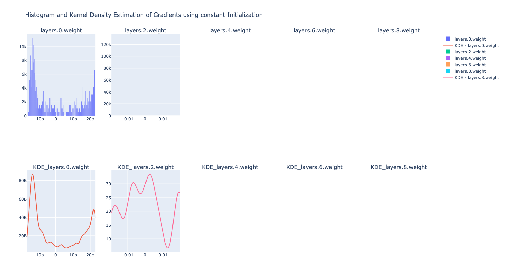
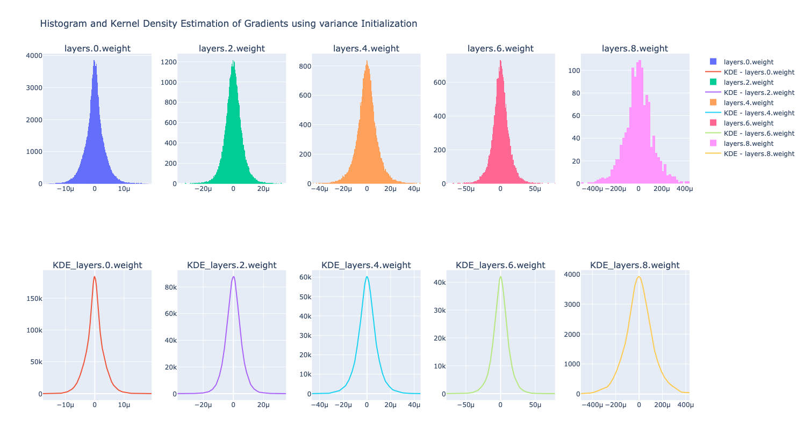
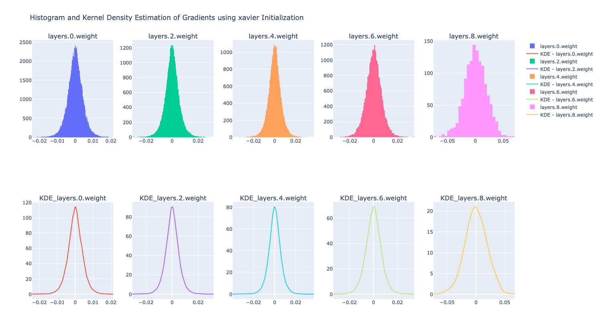
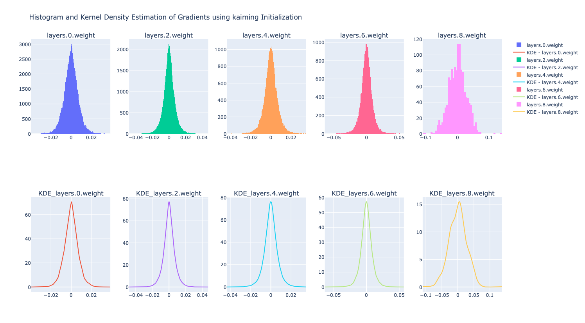

# Impact of Initialization Strategies
The predictive performance of neural networks is largely influenced by their underlying design choices. 
In particular, choice such as the number of layers and neurons, type of activation function used, and 
parameter initialization strategies. The focus of this particular experiment is understand the impact 
of different initialization strategies, such as constant value initialization, constant variance initialization,
Kaiming initialization, and Xavier initialization, on the training dynamics and predictive performance of neural
networks.

To study the impact of different initialization strategies, first we need to establish what are some desirable 
properties we are looking for from the initialized parameters. These properties are: 
1.	**Similar variance of activations across layers**: Maintaining similar variance of activations across layers 
ensures that signals neither vanish nor explode as they propagate forward through the network. 
This stability allows each layer to learn effectively and prevents information loss or amplification that would
otherwise make training inefficient.
2.	**Similar variance of gradients across layers**: Equally important is preserving the variance of gradients as 
they flow backward during training. If gradient variance shrinks too much, the network suffers from the vanishing
gradient problem, causing slow or stalled learning in earlier layers. Conversely, if gradient variance grows 
uncontrollably, the network encounters the exploding gradient problem, leading to unstable updates. 
Exploding and vanishing gradient problem can also be result of selected activation function. 

The experimental setup will utilize a fixed neural network architecture (4-layer feed forward neural network),
activation function, and a single dataset. 

The impact of initialization strategies varies significantly across different activation functions (Tanh, Sigmoid, ReLU, etc.). The following observations were made:

- **Constant Initialization (small constants):**
  - Produces highly concentrated density distributions for weights and parameters.
  - Results in no effective gradient flow beyond the first layer, preventing learning.
  - 

- **Constant Variance Initialization:**
  - Produces gradients of very small magnitude (on the order of \(10^{-5}\)).
  - Learning is severely slowed due to poor gradient propagation.
  - 

- **Xavier Initialization:**
  - Designed to maintain the variance of activations across all layers.
  - Produces stable gradient flow compared to constant initialization methods.
  - 

- **Kaiming Initialization:**
  - Designed to maintain stable variance for both activations and gradients, especially for ReLU-like activations.
  - Provides more reliable gradient flow compared to Xavier when used with ReLU.
  - 

As expected, Xavier and Kaiming initializations demonstrate significantly better performance.

