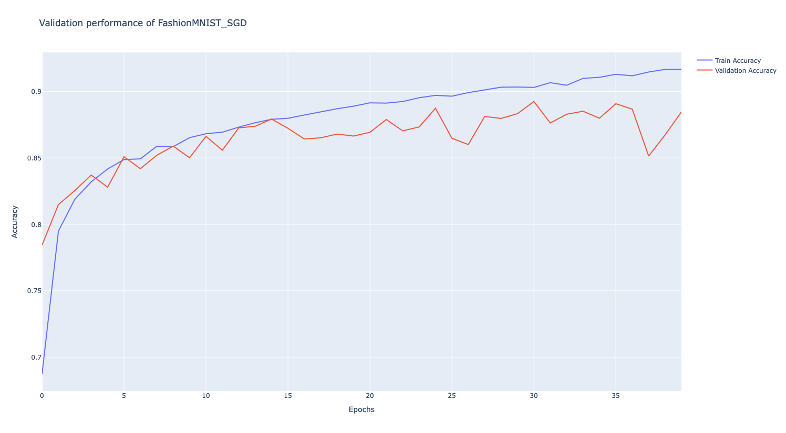
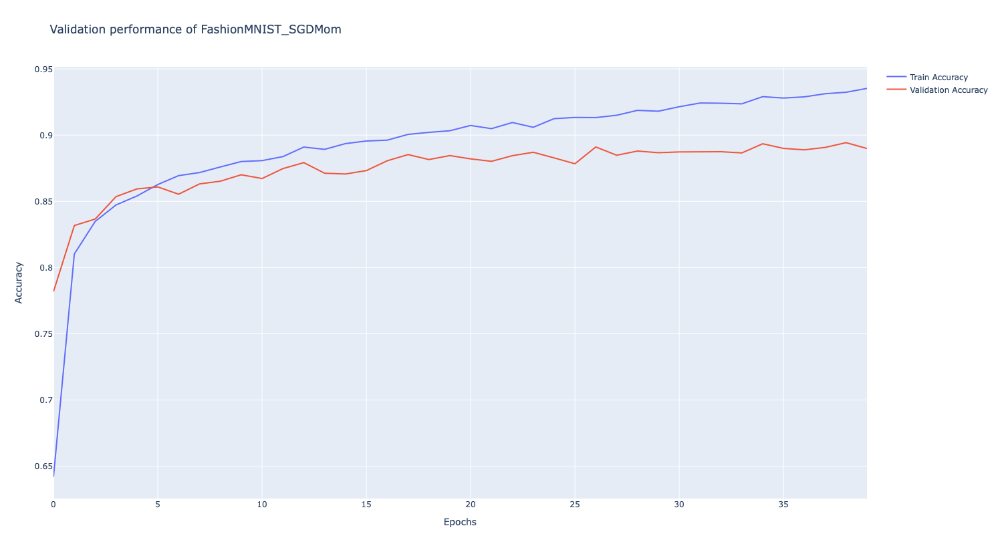
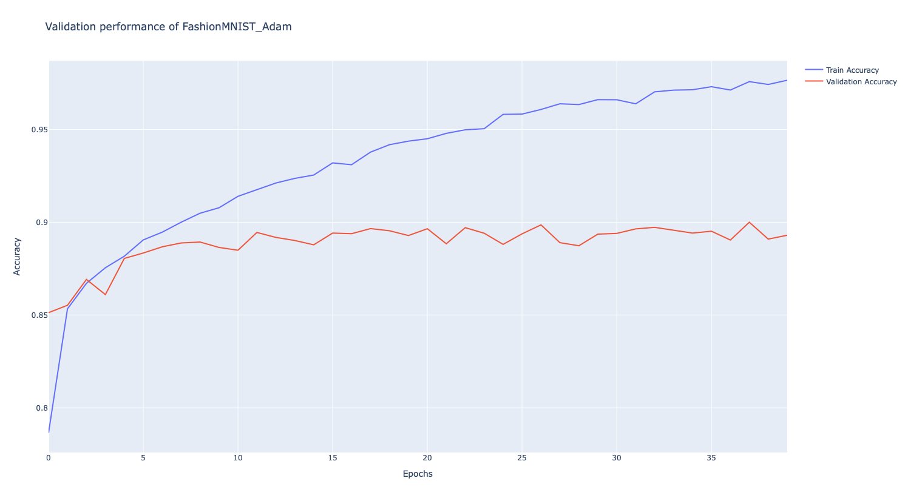
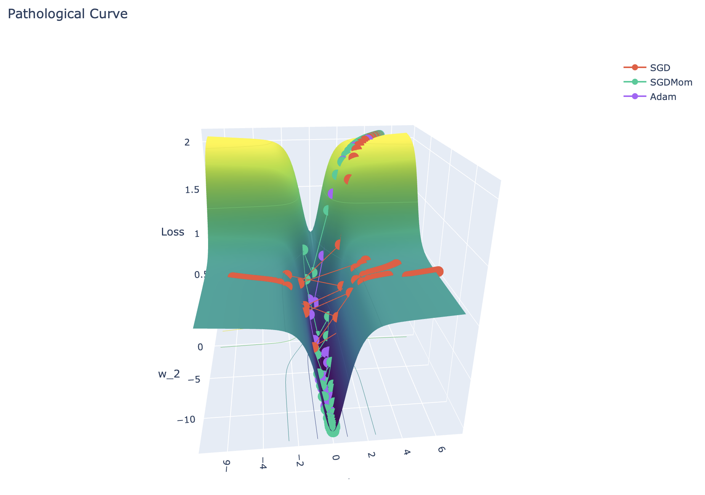

# Optimizer Comparison on FashionMNIST

This project investigates the impact of different optimization methods on training a feed-forward neural network using the
FashionMNIST dataset.

## Experimental Setup
- **Dataset**: FashionMNIST  
- **Model Architecture**: 4-layer feed-forward neural network  
- **Activation Function**: `tanh`  
- **Optimizers Tested**:
  - Stochastic Gradient Descent (SGD)
  - Stochastic Gradient Descent with Momentum
  - Adam

The key idea is to evaluate how different optimization algorithms affect model training and validation performance under
the same architecture and dataset.
---
## Results

### 1. SGD (Stochastic Gradient Descent)

- **Observation**:  
  - Rapid improvement in the first few epochs.  
  - Training accuracy increases steadily, but validation accuracy oscillates.  
  - Indicates difficulty converging smoothly on the loss surface.  

---

### 2. SGD with Momentum
 

- **Observation**:  
  - Momentum helps accelerate learning in relevant directions.  
  - Reduces oscillations and speeds up convergence compared to vanilla SGD.  

---

### 3. Adam Optimizer
 

- **Observation**:  
  - Adaptive learning rate makes Adam more robust to initialization.  
  - Generally converges faster and more smoothly.  
  - Provides stable validation accuracy with less oscillation.  

---

## Discussion

- All three optimizers achieved **comparable final performance** on FashionMNIST.  
- The differences were small in this setup, but optimizers can behave differently depending on the dataset, initialization,
- and network architecture.  
- **Key takeaway**:  
  - **SGD**: Simple but can struggle with convergence.  
  - **SGD + Momentum**: Helps reduce oscillations and improves convergence.  
  - **Adam**: More robust, adaptive, and typically faster to converge.  

---

## Loss Surfaces and Optimizers

The differences between optimizers are clearer on **pathological loss surfaces**, where one dimension has steep gradients
while another is shallow.  

- **SGD**: Struggles, leading to zig-zagging across steep valleys.  
- **Momentum**: Helps smooth the trajectory and progress faster.  
- **Adam**: Adjusts learning rate adaptively, making it more robust to such situations.  

---
## Conclusion

While all optimizers reached similar performance on FashionMNIST with this architecture, Adam generally provides more 
stability and robustness. For more complex tasks and architectures, the choice of optimizer becomes increasingly critical.
